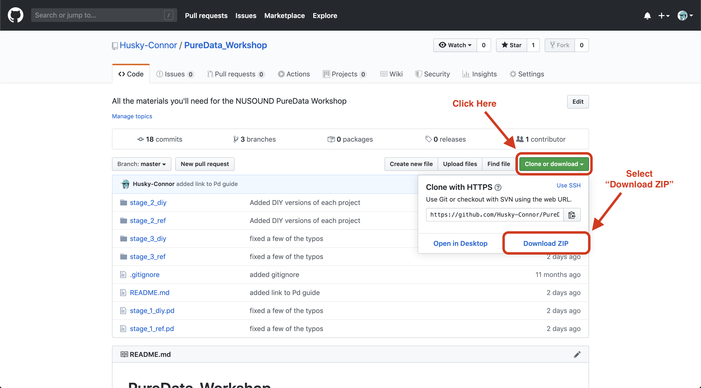
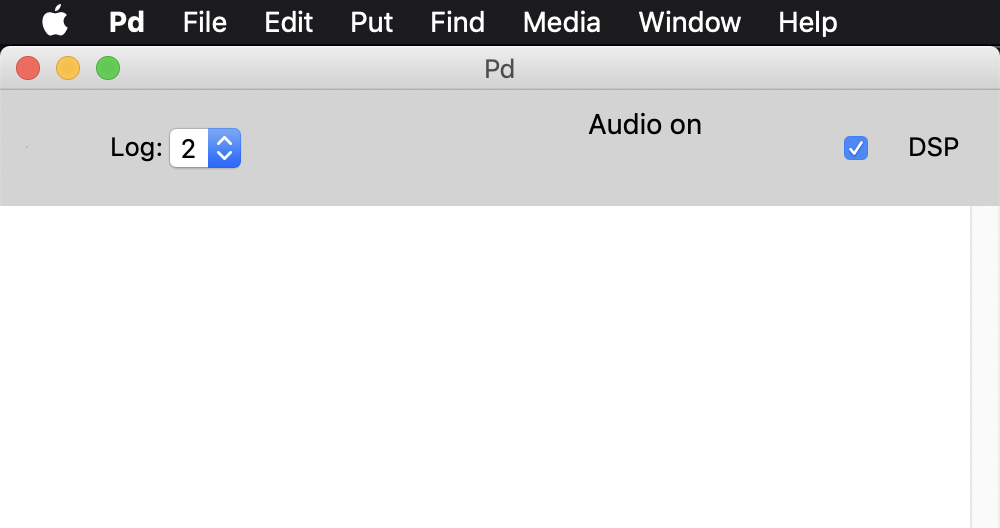
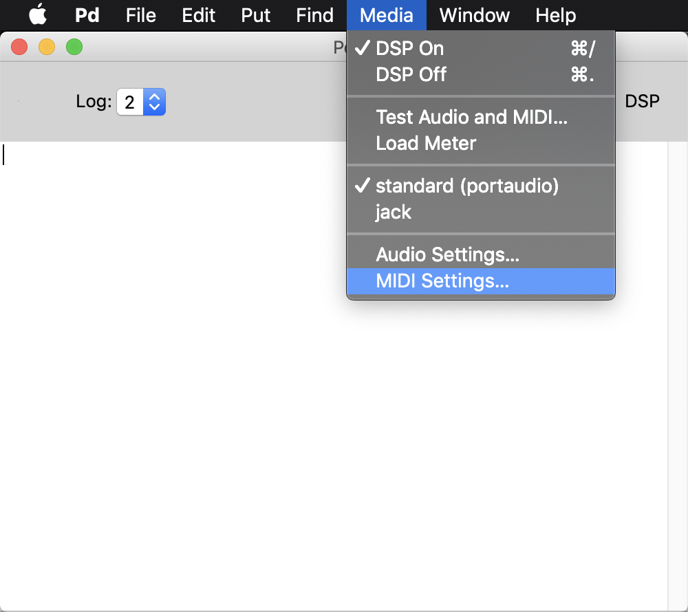
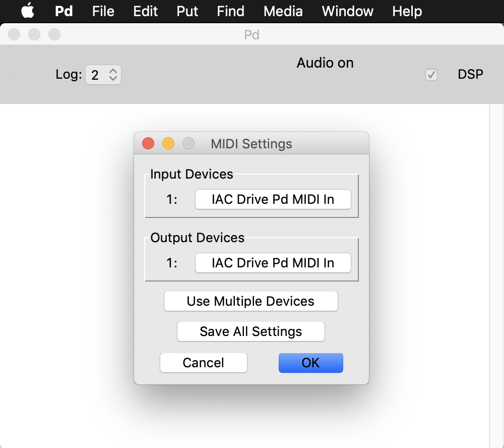
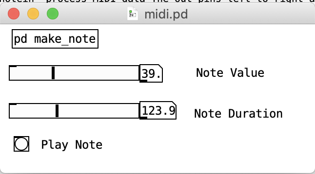
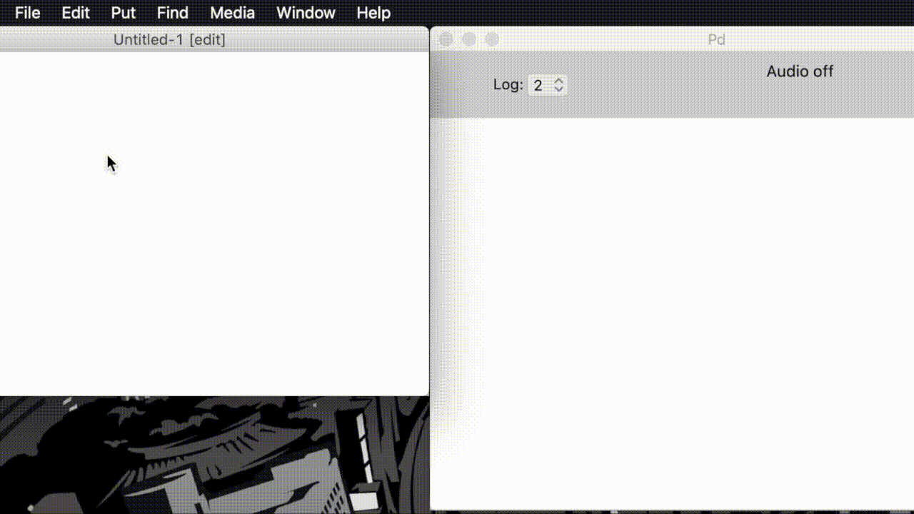
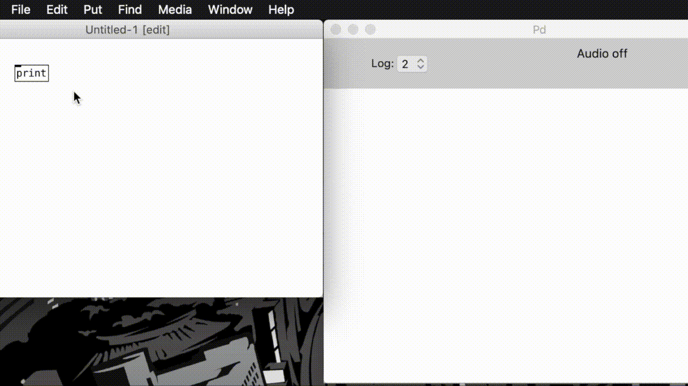
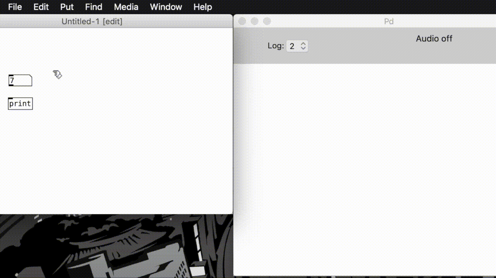
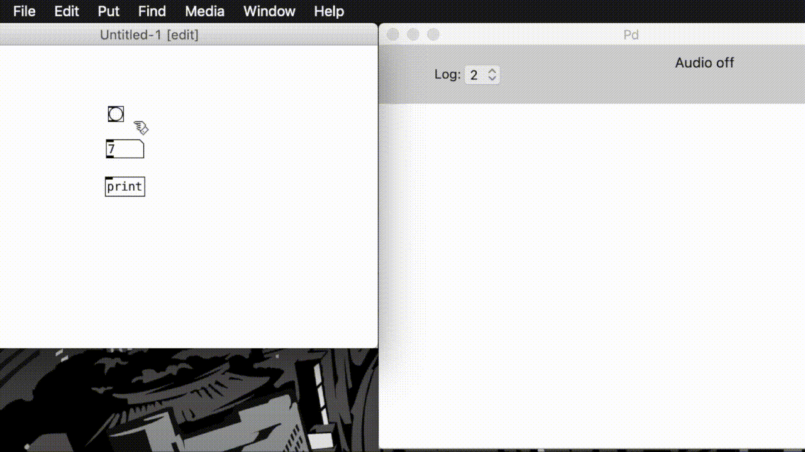

# PureData_Workshop
This repository contains all the materials you'll need for the NUSOUND PureData Workshop.
All patches were made using pd version 0.48.1.

Download Pd: https://puredata.info/downloads/pure-data

## Download Instructions
Click the green "Clone or Download" button above and select 
"Download ZIP". Unzip the package on your machine and you're 
good to go!

## Audio
To allow Pd to compute audio signals and let you hear stuff,
you'll need to make sure you have "Audio on" in the console
window. Clicking the little box next to "DSP" will enable
"Digital Signal Processing". If you ever find yourself unable
to hear anything, check this option first!

## MIDI Setup
This workshop requires a MIDI controller to play notes; however, that doesn't mean you need a physical one! I have included a patch called
`midi.pd` that sends MIDI notes, so you just have to configure 
PureData to use the same MIDI device for input and output.

First, go to "Media > MIDI Settings..."

Then, set both the Input and Output Devices to the same device

Now, if you open `midi.pd`, you can send notes to any of the patches
in this workshop! Use the sliders to change the note value and the 
duration of the note. Hitting "Play Note" will send the previously
selected note value again.

If you get stuck, or need help setting up a hardware device, here is more documentation:
http://write.flossmanuals.net/pure-data/using-midi/

## Using Pd

### Creating an Object
To create an Object, go to the Put menu and select Object.
A blank rectangle will appear in our patch (the window on the right).
Use your keyboard to name the object. The name will define
its behaviour. Here, we will make a print object, which outputs
data to the console (the window on the right).

Go to: "put > Object (cmd+1)"

### Creating a Number
Creating a number works the same way as creating an object; however,
you don't need to name a number.

Go to: "put > Number (cmd+3)"

### Edit Mode
Up until now, we have been in "Edit Mode" (denoted by the [edit]
text next to our file name). This allows us to edit the name and 
positions of our objects. However, you will notice that you can't
edit the value of our number object. To do this, we need to exit
edit mode. 

Go to "Edit > Edit Mode (cmd+E)"

### Creating a Bang
A bang is a generic momentary message in PureData .
It doesn't really have a value, so it's just a good way to activate
our number object without changing a value.

Go to: "put > Bang (shift+cmd+B)"

### Making Connections
Finally, to put our patch together, we need to connect the outlets
(black lines on the bottom) to the inlets (black lines on top). Note
that Pd's signal flow is vertical from the top down. While in edit
mode, move your mouse over the black lines until the cursor becomes 
a circle. Click and drag to the next object until your cursor becomes
a circle again. Release and voila! You've made a connection!

### Using the Patch
To use the patch, exit edit mode and click the bang object. Wow!
Neat! Note that the numbers value only gets printed in two cases:
it changes, or the bang is clicked. This is why the bang is useful. It allows us to send the numbers value down stream without having to change it. 

### More Info

There is a whole lot more to learn about Pd, so if you get stuck or want to go even further, hit up this comprehensive tutorial on Programming Electronic Music in Pd: http://www.pd-tutorial.com/english/index.html

## Overview
There are 3 "stages" to this project, represented by 3 PureData Projects.
Stage 1 uses only a single `.pd` file, while stages 2 and 3 use multiple files (hence the folders). 

NOTE: you only need to open the `main.pd` file.

Each stage has two versions: a "ref" version for reference, and a "diy" version.
The reference versions are completely finished while the diy versions have all the blocks
but still need all the connections to be made. This gives you three choices:
* Create your own project and build everything from scratch
* Open the diy files and fill in the connections
* Just use the reference projects and have fun playing the synths

Either way, the reference files are there to show you what the finished patch should look like. They also include blurbs that walk you through what is going on in the patch! 

Here's a brief summary of each stage:

## Stage 1
* Monophonic (one note at a time) sawtooth synth with a volume slider
* Uses basic MIDI processing and waveform generation (see MIDI setup instructions below)

## Stage 2
* Sawtooth synth with 8-voice polyphony and an ADSR envelope
* Uses abstraction (multiple files) to make life easier
* Send and receive utilities are used to pass signals between files
* Files are as follows:
	* main.pd: serves as the highest-level file that calls the others to generate notes
	* note.pd: generates tones based on the values passed to it by main.pd
	* adsr.pd: generates an envelope that modulates the dynamics of each note
## Stage 3
* Sawtooth synth with 8-voice polyphony, ADSR envelope, and a parameter-controlled filter
* Builds upon skills learned in stage 2
* filter.pd adjusts the frequency content of each note according to its four parameters:
	* Start: starting frequency
	* End: ending frequency
	* Time: time it takes to move from Start to End
	* Q: the q factor of the filter (try playing with the value to figure out what it does before googling it!)

Every file has comments to help you understand the functionality of each block and what's going on.
Feel free to download the patches and remix them!
Possible add-ons include:
* Using other waveforms like cos or sin in note.pd
* Changing the filter type or adding more filters
* Adding a "harmony" section 